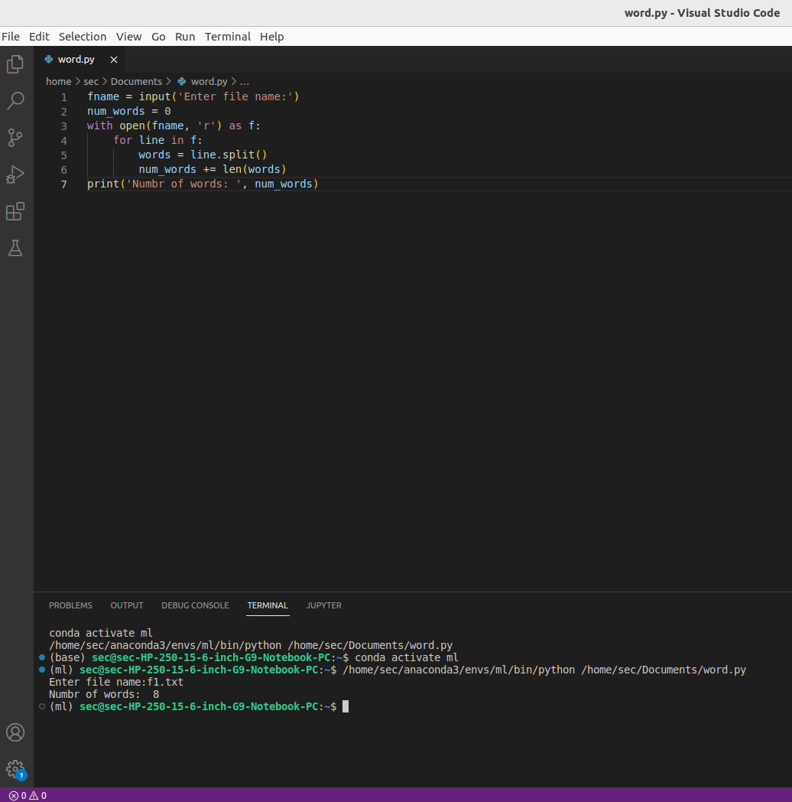

# Word-count
## AIM:
To write a python program for getting the word count from a text.
## EQUIPEMENT'S REQUIRED: 
PC
Anaconda - Python 3.7
## ALGORITHM: 
### Step 1:
first take input of the user
### Step 2: 
 using open function to open
### Step 3: 
use for loop
### Step 4:  
the length of the split list should be equal to the number of words in the text files
### Step 5: 
now,print()
### Step 6: 
end the program
## PROGRAM:
fname = input('Enter file name:')
num_words = 0
with open(fname, 'r') as f:
    for line in f:
        words = line.split()
        num_words += len(words)
print('Numbr of words: ', num_words)
### OUTPUT:

## RESULT:
Thus the program is written to find the word count from a text.
